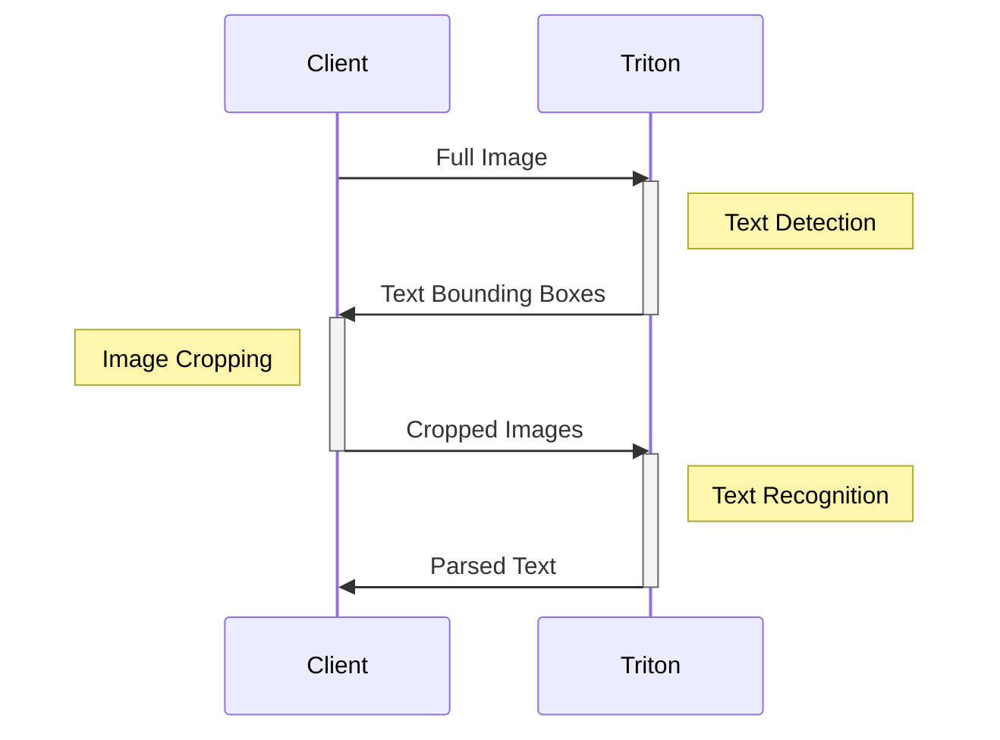
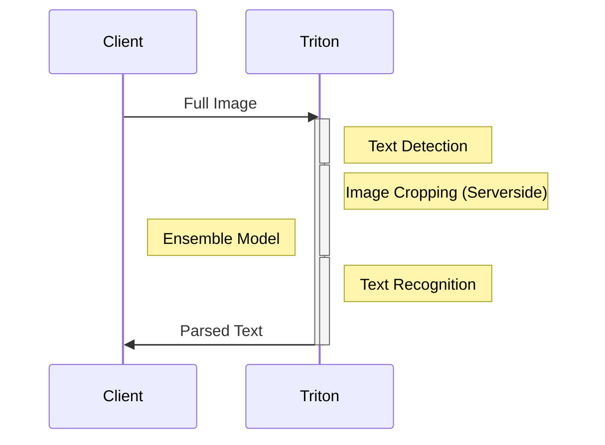

# Investigative Report on NVIDIA Triton

## Introduction

1. A Triton environment was deployed on Windows using WSL2.
   1. To deploy NVIDIA Triton, it is necessary to install NVIDIA drivers, Docker, and NVIDIA-Docker, among other things. On Linux, this process is much simpler [click here for more information](https://docs.nvidia.com/deeplearning/frameworks/preparing-containers/index.html).
2. The guide proposed by the official website was followed up to section 4, leaving the last two sections pending: Part_5 Model_Ensembles and Part_6 Building_Complex_Pipelines.
3. The following report was synthesized from the experience.

NVIDIA Triton is a tool designed for deploying neural network models from various backends, primarily including TensorRT, TensorFlow, PyTorch, and ONNXRuntime, simultaneously. As explained on the official NVIDIA Triton page, it aims to address a range of issues related to the use of neural networks in production environments, some of which are:

1. Inefficient use of computing capacity.
   This section describes how, before NVIDIA Triton, using different models on the same GPU device required a process of upload and downgrade. It also discusses how the use of purpose-specific cards can be an option, but it is far from ideal.
2. Versioning.
   This section explains how in production environments, it is necessary to use different versions of the same neural network, and this process undergoes the same upload and downgrade process previously mentioned.
3. Scaling and access.
   This section describes how in production environments, it is necessary to access the machine where the network is deployed and perform a range of preprocessing and postprocessing on the same server running the network. It explains that it is often difficult to keep the deployment environments clean.

In all these cases, NVIDIA Triton proposes solutions that we will explore throughout this report.

Following the proposed path ([Quickstart](https://docs.nvidia.com/deeplearning/triton-inference-server/user-guide/docs/getting_started/quickstart.html) and [Conceptual Guide](https://github.com/triton-inference-server/tutorials/tree/main/Conceptual_Guide)), it was possible to run models from different backends such as TensorFlow and PyTorch, converting them to ONNXRuntime, and then deploying them on the NVIDIA Triton server. It is presumed that the reason for this transformation is for performance purposes. It was discovered that the basic example presented in the introductory section has a compatibility error, and when attempting to launch the server, it fails with an error. Upon investigation, the problem was identified: one of the models does not load on the server (the reason remains to be discovered, but it is suspected to be due to versioning; the model causing the error is in PyTorch). Once resolved (by removing the problematic model), the server launches without issues, leading to the conclusion that if one of the models does not work, regardless of the reason, the server will fail to start.

## Case Presentation

During this report, we will explore and explain the use of this technology through a test case involving the detection and extraction of text from images, a problem widely known and debated for its complexity. The practical application of the solution is divided into five known parts:

1. Pre-process images.
2. Detect which part of the image contains the text to be recognized (Text Detection Model).
3. Crop the image into regions that contain text.
4. Identify the probabilities of text (Text Recognition Model).
5. Convert probabilities into text.

### Process Description

We begin by downloading the two models:


```bash
# Text Detection Model
wget https://www.dropbox.com/s/r2ingd0l3zt8hxs/frozen_east_text_detection.tar.gz
tar -xvf frozen_east_text_detection.tar.gz

# Text Recognition Model
wget https://www.dropbox.com/sh/j3xmli4di1zuv3s/AABzCC1KGbIRe2wRwa3diWKwa/None-ResNet-None-CTC.pth
```

Once we have both models, we need to convert them to ONNXRuntime format. The first model, `frozen_east_text_detection`, is in TensorFlow, and can be converted using a Python module as follows:

```bash
pip install -U tf2onnx
python -m tf2onnx.convert --input frozen_east_text_detection.pb --inputs "input_images:0" --outputs "feature_fusion/Conv_7/Sigmoid:0","feature_fusion/concat_3:0" --output detection.onnx
```

The second model is a PyTorch model, and the tutorial provides a library named [utils](https://github.com/triton-inference-server/tutorials/tree/main/Conceptual_Guide/Part_1-model_deployment/utils) which contains the necessary code to convert it:

Here is the code:

```python
import torch
from utils.model import STRModel

# Create PyTorch Model Object
model = STRModel(
    input_channels=1,
    output_channels=512,
    num_classes=37
)

# Load model weights from external file
state = torch.load("None-ResNet-None-CTC.pth")

state = {
    key.replace("module.", ""): value
    for key, value in state.items()
}

model.load_state_dict(state)

# Create ONNX file by tracing model
trace_input = torch.randn(1, 1, 32, 100)

torch.onnx.export(model, trace_input, "str.onnx", verbose=True)
```

Once we have both models, NVIDIA Triton requires a specific structure to host the models, necessitating placing the models within this structure:

```
# Example repository structure
<model-repository>/
  <model-name>/
    [config.pbtxt]
    [<output-labels-file> ...]
    <version>/
      <model-definition-file>
    <version>/
      <model-definition-file>
    ...
  <model-name>/
    [config.pbtxt]
    [<output-labels-file> ...]
    <version>/
      <model-definition-file>
    <version>/
      <model-definition-file>
    ...
  ...
```

For these models, we will use the following configuration files for each model:

For Text Detection:
```config.pbtxt
name: "text_detection"
backend: "onnxruntime"
max_batch_size : 0
input [
  {
    name: "input_images:0"
    data_type: TYPE_FP32
    dims: [ -1, -1, -1, 3 ]
  }
]
output [
  {
    name: "feature_fusion/Conv_7/Sigmoid:0"
    data_type: TYPE_FP32
    dims: [ -1, -1, -1, 1 ]
  },
  {
    name: "feature_fusion/concat_3:0"
    data_type: TYPE_FP32
    dims: [ -1, -1, -1, 5 ]
  }
]
```

For Text Recognition:
```config.pbtxt
name: "text_recognition"
backend: "onnxruntime"
max_batch_size : 0
input [
  {
    name: "input.1"
    data_type: TYPE_FP32
    dims: [ 1, 1, 32, 100 ]
  }
]
output [
  {
    name: "308"
    data_type: TYPE_FP32
    dims: [ 1, 26, 37 ]
  }
]
```

These configuration files specify the input and output specifications for each model within the NVIDIA Triton server environment.

Once the models are structured in the required folder and file configuration, we proceed to run the server. To do this, we download the appropriate NVIDIA Triton Server image, in this case `nvcr.io/nvidia/tritonserver:24.03-py3`. For this report, we consistently use version 24.03 for all NVIDIA docker images.


This version is compatible with the RTX 2060 card we have:


With the models properly organized and the Docker image selected, we run the following Docker command:

```bash
docker run --gpus=all -it --shm-size=256m --rm -p8000:8000 -p8001:8001 -p8002:8002 -v <path_repository_models>:/models nvcr.io/nvidia/tritonserver:24.03-py3 tritonserver --model-repository=/models
```

Once the NVIDIA Triton server is operational, we move on to making inferences. In this case, we will use Python as the client, but it is possible to use a [variety of languages](https://docs.nvidia.com/deeplearning/triton-inference-server/archives/triton_inference_server_1150/user-guide/docs/client_example.html). For this, we install the `nvidia-triton[http]` client as we will use HTTP to connect to the server, although other options are available in the documentation.

```bash
pip install tritonclient[http] opencv-python-headless
```

With that installed, we can proceed to make inferences using the [client.py](/client.py) file and the following image:


### Step-by-step of the client example

#### 1. Connecting to the NVIDIA Triton server, in this case running on our localhost

```python
# Setting up client
client = httpclient.InferenceServerClient(url="localhost:8000")
```

#### Load the image

```python
# Read image and create input object
raw_image = cv2.imread("./Part_1-model_deployment/img1.jpg")
```

#### Pre-process the image

```python
preprocessed_image = detection_preprocessing(raw_image)
```


The image is now resized to the dimensions expected by the network and adjusted for the colors for which the recognition network was trained.

#### Creating a pointer to the inference layer of the first model, loading data into the inference layer, executing the inference, and capturing the inference result

```python
detection_input = httpclient.InferInput(
    "input_images:0",
    preprocessed_image.shape,
    datatype="FP32"
)
```

Note here two things:

1. It is not linked to the client.
2. It is not linked to any specific model.

**You load the data into the input layer but have not yet sent it to the server**

```python
detection_input.set_data_from_numpy(preprocessed_image, binary_data=True)
```

**You send the data to the server to be processed and in return, you receive each output layer**

```python
# Query the server
detection_response = client.infer(
    model_name="text_detection", inputs=[detection_input]
)
```

**Capture of the inference return**

```python
# Process responses from detection model
scores = detection_response.as_numpy("feature_fusion/Conv_7/Sigmoid:0")
geometry = detection_response.as_numpy("feature_fusion/concat_3:0")
```

Here we take the values from the output, noting that it has two layers and we need to obtain the return value from both. These values encapsulate the text-containing boxes and the probabilities of containing text. The return from this network is also not entirely clean, so a process of selecting information inferred by the network, refining it, and selecting it is necessary. This process is standard for the use of this network and is well documented, so it is not emphasized in this report [more information here](https://pyimagesearch.com/2018/08/20/opencv-text-detection-east-text-detector/). We proceed with the return information to perform post-processing of our image, which consists of cropping the image fragment that contains the text, and the alignment so that the Text Recognition Model returns the expected results.

#### Post-processing the image using the return from the detection network

```python
cropped_images = detection_postprocessing(
    scores,
    geometry,
    preprocessed_image
)
```

This function encompasses all the image post-processing and this is what it returns:


As can be seen, this image must have a specific size to enter the text recognition layer, all of which was considered in the method detection_postprocessing.

#### Text inference process

```python
# Create input object for recognition model
recognition_input = httpclient.InferInput(
    "input.1", cropped_images.shape, datatype="FP32"
)
recognition_input.set_data_from_numpy(cropped_images, binary_data=True)

# Query the server
recognition_response = client.infer(
    model_name="text_recognition", inputs=[recognition_input]
)

```

This code is very similar to the previous one. Here you are creating the layer, loading the data, and sending it to Triton for inference.

```python
# Process response from recognition model
detection_308 = recognition_response.as_numpy("308")
final_text = recognition_postprocessing(detection_308)

print(final_text)
```

The post-processing of the result of this network obtains the probability that each letter is each of the letters; we keep the highest and obtain the text:
in this case, that print returns 'stop'.


### Related Notes

When we perform this inference process, we can describe the process in the following way:



This approach is traditional; this is how it is currently done with some variations. NVIDIA Triton proposes an even more efficient alternative using **Model Ensembles**. With the use of these models, our architecture might look like the following:



In the next iteration of this Report, we will clarify how this process is carried out.

## Nvidia-Triton, Other Advantages

As mentioned in the introduction, NVIDIA Triton not only solves "efficiency" concerning the use of the GPU and multiple models, but also allows for other optimizations from its server layer, such as **dynamic batching**. Dynamic batching is used when you have more than one client making inferences, and the server software layer processes these requests and sends them to the GPU for inference. As is known, sometimes we have to compact these requests before sending them to the GPU because one at a time takes more time... well, NVIDIA Triton has a configuration that allows this functionality called dynamic batching, its configuration is noted for its simplicity.

Within the model configuration file, we add the following lines:

```
dynamic_batching {
    max_queue_delay_microseconds: 100
}
```

Another optimization is **Concurrent model execution**; this functionality is used when there is a model that may be light but has high demand; it can be executed more than once to perform inferences in parallel.

Within the model configuration file, we add the following lines:

```
instance_group [
  {
    count: 2
    kind: KIND_GPU
  }
]
```